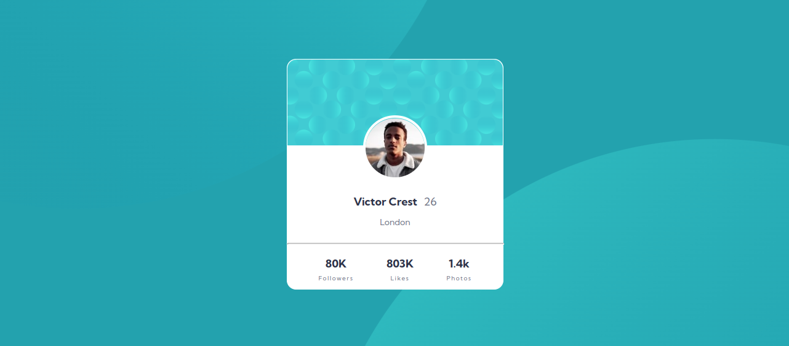

# Frontend Mentor - Profile card component solution

This is a solution to the [Profile card component challenge on Frontend Mentor](https://www.frontendmentor.io/challenges/profile-card-component-cfArpWshJ). Frontend Mentor challenges help you improve your coding skills by building realistic projects.

## Table of contents

- [Overview](#overview)
  - [The challenge](#the-challenge)
  - [Screenshot](#screenshot)
  - [Links](#links)
- [My process](#my-process)
  - [Built with](#built-with)
  - [What I learned](#what-i-learned)
- [Author](#author)

## Overview

### The challenge

- Build out the project to the designs provided

### Screenshot

### Links

- Solution URL: [https://github.com/superschooler/profile-card-component](https://github.com/superschooler/profile-card-component)
- Live Site URL: [https://superschooler.github.io/profile-card-component/](https://superschooler.github.io/profile-card-component/)

## My process

### Built with

- Semantic HTML5 markup
- CSS custom properties
- Flexbox
- Mobile-first workflow
- [Sass](https://sass-lang.com/)

### What I learned

This was a quick, easy project I wanted to knock out after work. I played with Sass a bit more and enjoyed a few extra positioning challenges, but for the most part I used fixed heights, widths, and positioning since it's not a responsive project.

## Author

- Website - [Brian Schooler](https://www.brianschooler.com)
- Frontend Mentor - [@superschooler](https://www.frontendmentor.io/profile/superschooler)
- Twitter - [@superschooler](https://www.twitter.com/yourusername)- Website - [Brian Schooler](https://www.brianschooler.com)
- Frontend Mentor - [@superschooler](https://www.frontendmentor.io/profile/superschooler)
- Twitter - [@superschooler](https://twitter.com/SuperSchooler)
- GitHub - [@superschooler](https://github.com/superschooler)
